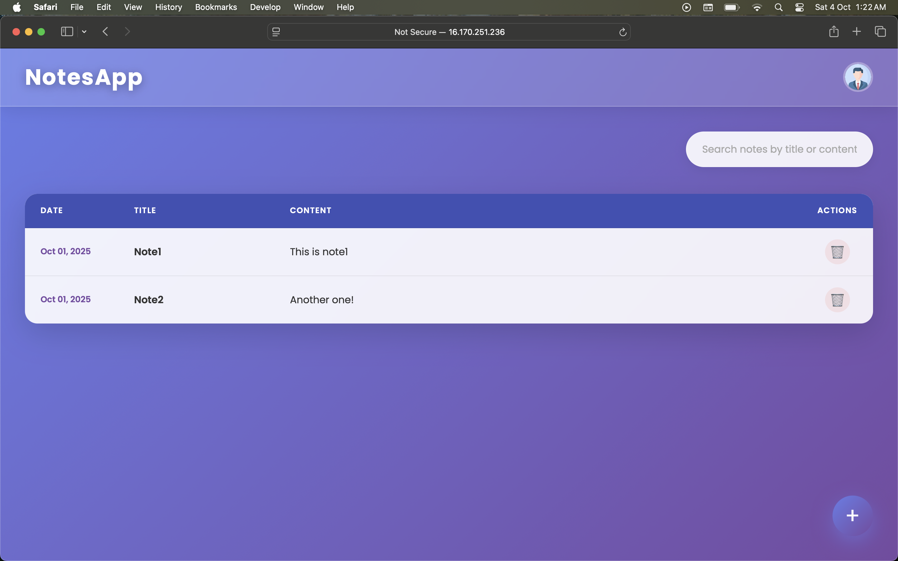

# 📝 Noted – Flask Notes App

A full-stack **Notes Web Application** built with **Flask** 💻, featuring **JWT authentication 🔐**, **SQLAlchemy ORM 🗄️**, and deployed on **AWS EC2 🌍** with **Aurora RDS** as the database.

This project demonstrates **backend + frontend integration**, secure **API design**, and deployment on cloud infrastructure 🚀.

🔗 **Live Demo**: [http://16.170.251.236/login](http://16.170.251.236/login)

---

## 📸 Screenshots

### 🔐 Login Screen

### 📝 Notes Dashboard

---

## 📱 Mobile & Cross-Platform App

This Flask backend is also used by the **Noted KMP App**, built with **Kotlin Multiplatform (KMP)**.  
It shares a single codebase for **Android, iOS, and Desktop**, consuming the same REST APIs as the web app.

🔗 [Noted KMP App Repository](https://github.com/khushhal-mandal/noted-app)

---

## ✨ Features

- 🔑 **User Authentication** – Register & login with JWT-based sessions
- 📝 **Notes Management** – Create, edit, and delete personal notes
- 🌐 **RESTful APIs** – Secure APIs for mobile/web integration
- 🗄️ **Aurora RDS Database** – Reliable & scalable cloud database
- 🔒 **Secure Passwords** – Stored using salted hashing (Werkzeug)
- ⚙️ **Environment Variables** – Managed with `python-dotenv`
- 🚀 **Deployed on AWS EC2** – Production-ready setup with Gunicorn + Nginx

---

## 🛠️ Tech Stack

- **Backend**: Flask (Python)
- **Database**: AWS Aurora RDS (MySQL)
- **Auth**: JWT (Flask-JWT-Extended)
- **Frontend**: Flask Templates (Jinja2 + HTML/CSS)
- **ORM**: SQLAlchemy
- **Deployment**: AWS EC2, Nginx, Gunicorn
- **Other Tools**: `python-dotenv`, `Werkzeug`

---

## ⚡ API Endpoints

| Method | Endpoint           | Description            | Auth Required |
|--------|------------------|-----------------------|---------------|
| POST   | `/api/register`   | Register a new user    | ❌           |
| POST   | `/api/login`      | Login & get JWT token  | ❌           |
| GET    | `/api/notes`      | Get all notes of a user| ✅           |
| POST   | `/api/notes`      | Create a new note      | ✅           |
| PUT    | `/api/notes/<id>` | Edit an existing note  | ✅           |
| DELETE | `/api/notes/<id>` | Delete a note          | ✅           |

✅ = Requires JWT token

---